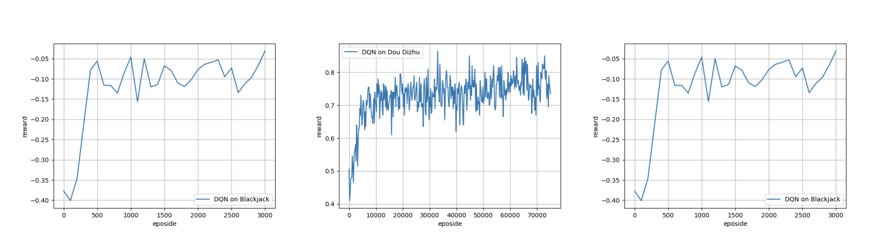

# RLCard: A Toolkit for Reinforcement Learning in Card Games
[](https://travis-ci.org/datamllab/RLCard)
[](https://www.codacy.com/manual/daochenzha/rlcard?utm_source=github.com&amp;utm_medium=referral&amp;utm_content=datamllab/rlcard&amp;utm_campaign=Badge_Grade)
[](https://coveralls.io/github/datamllab/rlcard?branch=master)

RLCard is a toolkit for developing Reinforcement Learning (RL) algorithms in card games. It supports multiple challenging card environments with common and easy-to-use interfaces. The goal of RLCard is to bridge reinforcement learning and game theory, and push forward the research of reinforcement learning in domains with multiple agents, imperfect information, and large state and action space. RLCard is developed by [DATA Lab](http://faculty.cs.tamu.edu/xiahu/) at Texas A&M University. **NOTE: The project is still in final testing!**

## Installation
Make sure that you have **Python 3.5+** and **pip** installed. You can install `rlcard` with `pip` as follow:
```console
git clone https://github.com/datamllab/rlcard.git
cd rlcard
pip install -e .
```
To check whether it is intalled correctly, try the example with random agents:
```console
python examples/blackjack_random.py
```

## Getting Started
We recommend starting with the following **toy examples**.

*   [Playing with random agents](docs/toy-examples.md#playing-with-random-agents)
*   [Deep-Q learning on Blackjack](docs/toy-examples.md#deep-q-learning-on-blackjack)
*   [Running multiple processes](docs/toy-examples.md#running-multiple-processes)

For more examples, please refer to [examples/](examples).

## Documents
Please refer to the [Documents](docs/README.md) for general introductions. API documents are available at our [github page](https://rlcard.github.io/index.html).

## Available Environments
We provide a complexity estimation for the games on several aspects. **InfoSet Number:** the number of information set; **Avg. InfoSet Size:** the average number of states in a single information set; **Action Size:** the size of the action space. **Name:** the name that should be passed to `env.make` to create the game environment.

| Game                                                                                                                                                                                           | InfoSet Number  | Avg. InfoSet Size | Action Size | Name            | Status    |
| :--------------------------------------------------------------------------------------------------------------------------------------------------------------------------------------------: | :-------------: | :---------------: | :---------: | :-------------: | :-------: |
| Blackjack ([wiki](https://en.wikipedia.org/wiki/Blackjack), [baike](https://baike.baidu.com/item/21%E7%82%B9/5481683?fr=aladdin))                                                              | 10^3            | 10^1              | 10^0        | blackjack       | Available |
| Leduc Hold’em                                                                                                                                                                                  | 10^2            | 10^2              | 10^0        | leduc-holdem    | Available |
| Limit Texas Hold'em ([wiki](https://en.wikipedia.org/wiki/Texas_hold_%27em), [baike](https://baike.baidu.com/item/%E5%BE%B7%E5%85%8B%E8%90%A8%E6%96%AF%E6%89%91%E5%85%8B/83440?fr=aladdin))    | 10^14           | 10^3              | 10^0        | limit-holdem    | Available |
| Dou Dizhu ([wiki](https://en.wikipedia.org/wiki/Dou_dizhu), [baike](https://baike.baidu.com/item/%E6%96%97%E5%9C%B0%E4%B8%BB/177997?fr=aladdin))                                               | 10^53 ~ 10^83   | 10^23             | 10^4        | doudizhu        | Available |
| Mahjong ([wiki](https://en.wikipedia.org/wiki/Competition_Mahjong_scoring_rules), [baike](https://baike.baidu.com/item/%E9%BA%BB%E5%B0%86/215))                                                | 10^121          | 10^48             | 10^2        | mahjong         | Available | 
| No-limit Texas Hold'em ([wiki](https://en.wikipedia.org/wiki/Texas_hold_%27em), [baike](https://baike.baidu.com/item/%E5%BE%B7%E5%85%8B%E8%90%A8%E6%96%AF%E6%89%91%E5%85%8B/83440?fr=aladdin)) | 10^162          | 10^3              | 10^4        | no-limit-holdem | Available |
| UNO ([wiki](https://en.wikipedia.org/wiki/Uno_\(card_game), [baike](https://baike.baidu.com/item/UNO%E7%89%8C/2249587))                                                                        |  10^163         | 10^10             | 10^1        | uno             | Available |
| Sheng Ji ([wiki](https://en.wikipedia.org/wiki/Sheng_ji), [baike](https://baike.baidu.com/item/%E5%8D%87%E7%BA%A7/3563150))                                                                    | 10^157 ~ 10^165 | 10^61             | 10^11       | -               | Come soon |

## Evaluation
The perfomance is measured by winning rate through self-play. Example outputs are as follows:


## Contributing
Contribution to this project is greatly appreciated! If you would like to contribute codes to the project, please create a issue for feedback or bugs, or a pull request for new features or bugs fixed.

## Acknowledgements
We would like to thank JJ World Network Technology Co.,LTD for the technical support.
