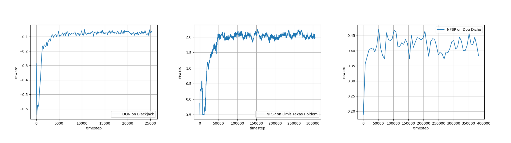

RLCard: A Toolkit for Reinforcement Learning in Card Games
==========================================================

|Build Status| |Codacy Badge| |Coverage Status|

RLCard is a toolkit for Reinforcement Learning (RL) in card games. It
supports multiple card environments with easy-to-use interfaces. The
goal of RLCard is to bridge reinforcement learning and imperfect
information games, and push forward the research of reinforcement
learning in domains with multiple agents, large state and action space,
and sparse reward. RLCard is developed by `DATA
Lab <http://faculty.cs.tamu.edu/xiahu/>`__ at Texas A&M University.

-  Official Website: http://www.rlcard.org

Installation
------------

Make sure that you have **Python 3.5+** and **pip** installed. You can
install ``rlcard`` with ``pip`` as follow:

::

   git clone https://github.com/datamllab/rlcard.git
   cd rlcard
   pip install -e .

Examples
--------

Please refer to `examples/ <examples>`__. A **short example** is as
below.

.. code:: python

   import rlcard
   from rlcard.agents.random_agent import RandomAgent

   env = rlcard.make('blackjack')
   env.set_agents([RandomAgent()])

   trajectories, payoffs = env.run()

We also recommend the following **toy examples**.

-  `Playing with random
   agents <docs/toy-examples.md#playing-with-random-agents>`__
-  `Deep-Q learning on
   Blackjack <docs/toy-examples.md#deep-q-learning-on-blackjack>`__
-  `Running multiple
   processes <docs/toy-examples.md#running-multiple-processes>`__
-  `Having fun with pretrained Leduc
   model <docs/toy-examples.md#having-fun-with-pretrained-leduc-model>`__
-  `Leduc Hold’em as single-agent
   environment <docs/toy-examples.md#leduc-holdem-as-single-agent-environment>`__

Demo
----

Run ``examples/leduc_holdem_human.py`` to play with the pre-trained
Leduc Hold’em model:

::

   >> Leduc Hold'em pre-trained model

   >> Start a new game!
   >> Agent 1 chooses raise

   =============== Community Card ===============
   ┌─────────┐
   │░░░░░░░░░│
   │░░░░░░░░░│
   │░░░░░░░░░│
   │░░░░░░░░░│
   │░░░░░░░░░│
   │░░░░░░░░░│
   │░░░░░░░░░│
   └─────────┘
   ===============   Your Hand    ===============
   ┌─────────┐
   │J        │
   │         │
   │         │
   │    ♥    │
   │         │
   │         │
   │        J│
   └─────────┘
   ===============     Chips      ===============
   Yours:   +
   Agent 1: +++
   =========== Actions You Can Choose ===========
   0: call, 1: raise, 2: fold

   >> You choose action (integer):

Documents
---------

Please refer to the `Documents <docs/README.md>`__ for general
introductions. API documents are available at our
`website <http://www.rlcard.org>`__.

Available Environments
----------------------

We provide a complexity estimation for the games on several aspects.
**InfoSet Number:** the number of information set; **Avg. InfoSet
Size:** the average number of states in a single information set;
**Action Size:** the size of the action space. **Name:** the name that
should be passed to ``env.make`` to create the game environment.

+----------------------------------------------------+---+---+---+---+---+
| Game                                               | I | A | A | N | S |
|                                                    | n | v | c | a | t |
|                                                    | f | g | t | m | a |
|                                                    | o | . | i | e | t |
|                                                    | S | I | o |   | u |
|                                                    | e | n | n |   | s |
|                                                    | t | f | S |   |   |
|                                                    | N | o | i |   |   |
|                                                    | u | S | z |   |   |
|                                                    | m | e | e |   |   |
|                                                    | b | t |   |   |   |
|                                                    | e | S |   |   |   |
|                                                    | r | i |   |   |   |
|                                                    |   | z |   |   |   |
|                                                    |   | e |   |   |   |
+====================================================+===+===+===+===+===+
| Blackjack                                          | 1 | 1 | 1 | b | A |
| (`wiki <https://en.wikipedia.org/wiki/Blackjack>`_ | 0 | 0 | 0 | l | v |
| _,                                                 | ^ | ^ | ^ | a | a |
| `baike <https://baike.baidu.com/item/21%E7%82%B9/5 | 3 | 1 | 0 | c | i |
| 481683?fr=aladdin>`__)                             |   |   |   | k | l |
|                                                    |   |   |   | j | a |
|                                                    |   |   |   | a | b |
|                                                    |   |   |   | c | l |
|                                                    |   |   |   | k | e |
+----------------------------------------------------+---+---+---+---+---+
| Leduc Hold’em                                      | 1 | 1 | 1 | l | A |
|                                                    | 0 | 0 | 0 | e | v |
|                                                    | ^ | ^ | ^ | d | a |
|                                                    | 2 | 2 | 0 | u | i |
|                                                    |   |   |   | c | l |
|                                                    |   |   |   | - | a |
|                                                    |   |   |   | h | b |
|                                                    |   |   |   | o | l |
|                                                    |   |   |   | l | e |
|                                                    |   |   |   | d |   |
|                                                    |   |   |   | e |   |
|                                                    |   |   |   | m |   |
+----------------------------------------------------+---+---+---+---+---+
| Limit Texas Hold’em                                | 1 | 1 | 1 | l | A |
| (`wiki <https://en.wikipedia.org/wiki/Texas_hold_% | 0 | 0 | 0 | i | v |
| 27em>`__,                                          | ^ | ^ | ^ | m | a |
| `baike <https://baike.baidu.com/item/%E5%BE%B7%E5% | 1 | 3 | 0 | i | i |
| 85%8B%E8%90%A8%E6%96%AF%E6%89%91%E5%85%8B/83440?fr | 4 |   |   | t | l |
| =aladdin>`__)                                      |   |   |   | - | a |
|                                                    |   |   |   | h | b |
|                                                    |   |   |   | o | l |
|                                                    |   |   |   | l | e |
|                                                    |   |   |   | d |   |
|                                                    |   |   |   | e |   |
|                                                    |   |   |   | m |   |
+----------------------------------------------------+---+---+---+---+---+
| Dou Dizhu                                          | 1 | 1 | 1 | d | A |
| (`wiki <https://en.wikipedia.org/wiki/Dou_dizhu>`_ | 0 | 0 | 0 | o | v |
| _,                                                 | ^ | ^ | ^ | u | a |
| `baike <https://baike.baidu.com/item/%E6%96%97%E5% | 5 | 2 | 4 | d | i |
| 9C%B0%E4%B8%BB/177997?fr=aladdin>`__)              | 3 | 3 |   | i | l |
|                                                    | ~ |   |   | z | a |
|                                                    | 1 |   |   | h | b |
|                                                    | 0 |   |   | u | l |
|                                                    | ^ |   |   |   | e |
|                                                    | 8 |   |   |   |   |
|                                                    | 3 |   |   |   |   |
+----------------------------------------------------+---+---+---+---+---+
| Mahjong                                            | 1 | 1 | 1 | m | A |
| (`wiki <https://en.wikipedia.org/wiki/Competition_ | 0 | 0 | 0 | a | v |
| Mahjong_scoring_rules>`__,                         | ^ | ^ | ^ | h | a |
| `baike <https://baike.baidu.com/item/%E9%BA%BB%E5% | 1 | 4 | 2 | j | i |
| B0%86/215>`__)                                     | 2 | 8 |   | o | l |
|                                                    | 1 |   |   | n | a |
|                                                    |   |   |   | g | b |
|                                                    |   |   |   |   | l |
|                                                    |   |   |   |   | e |
+----------------------------------------------------+---+---+---+---+---+
| No-limit Texas Hold’em                             | 1 | 1 | 1 | n | A |
| (`wiki <https://en.wikipedia.org/wiki/Texas_hold_% | 0 | 0 | 0 | o | v |
| 27em>`__,                                          | ^ | ^ | ^ | - | a |
| `baike <https://baike.baidu.com/item/%E5%BE%B7%E5% | 1 | 3 | 4 | l | i |
| 85%8B%E8%90%A8%E6%96%AF%E6%89%91%E5%85%8B/83440?fr | 6 |   |   | i | l |
| =aladdin>`__)                                      | 2 |   |   | m | a |
|                                                    |   |   |   | i | b |
|                                                    |   |   |   | t | l |
|                                                    |   |   |   | - | e |
|                                                    |   |   |   | h |   |
|                                                    |   |   |   | o |   |
|                                                    |   |   |   | l |   |
|                                                    |   |   |   | d |   |
|                                                    |   |   |   | e |   |
|                                                    |   |   |   | m |   |
+----------------------------------------------------+---+---+---+---+---+
| UNO                                                | 1 | 1 | 1 | u | A |
| (`wiki <https://en.wikipedia.org/wiki/Uno_(card_ga | 0 | 0 | 0 | n | v |
| me>`__,                                            | ^ | ^ | ^ | o | a |
| `baike <https://baike.baidu.com/item/UNO%E7%89%8C/ | 1 | 1 | 1 |   | i |
| 2249587>`__)                                       | 6 | 0 |   |   | l |
|                                                    | 3 |   |   |   | a |
|                                                    |   |   |   |   | b |
|                                                    |   |   |   |   | l |
|                                                    |   |   |   |   | e |
+----------------------------------------------------+---+---+---+---+---+
| Sheng Ji                                           | 1 | 1 | 1 | - | D |
| (`wiki <https://en.wikipedia.org/wiki/Sheng_ji>`__ | 0 | 0 | 0 |   | e |
| ,                                                  | ^ | ^ | ^ |   | v |
| `baike <https://baike.baidu.com/item/%E5%8D%87%E7% | 1 | 6 | 1 |   | e |
| BA%A7/3563150>`__)                                 | 5 | 1 | 1 |   | l |
|                                                    | 7 |   |   |   | o |
|                                                    | ~ |   |   |   | p |
|                                                    | 1 |   |   |   | i |
|                                                    | 0 |   |   |   | n |
|                                                    | ^ |   |   |   | g |
|                                                    | 1 |   |   |   |   |
|                                                    | 6 |   |   |   |   |
|                                                    | 5 |   |   |   |   |
+----------------------------------------------------+---+---+---+---+---+

Evaluation
----------

The perfomance is measured by winning rate through tournaments. Example
outputs are as follows: |Learning Curves|

Contributing
------------

Contribution to this project is greatly appreciated! Please create a
issue/pull request for feedbacks/bugs/new features.

Acknowledgements
----------------

We would like to thank JJ World Network Technology Co.,LTD for the
technical support.

.. |Build Status| image:: https://travis-ci.org/datamllab/RLCard.svg?branch=master
   :target: https://travis-ci.org/datamllab/RLCard
.. |Codacy Badge| image:: https://api.codacy.com/project/badge/Grade/248eb15c086748a4bcc830755f1bd798
   :target: https://www.codacy.com/manual/daochenzha/rlcard?utm_source=github.com&utm_medium=referral&utm_content=datamllab/rlcard&utm_campaign=Badge_Grade
.. |Coverage Status| image:: https://coveralls.io/repos/github/datamllab/rlcard/badge.svg?branch=master
   :target: https://coveralls.io/github/datamllab/rlcard?branch=master

